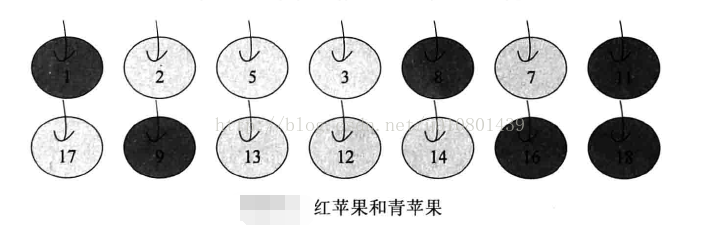
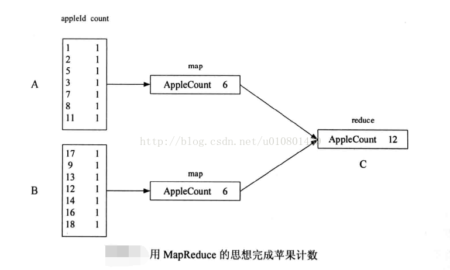
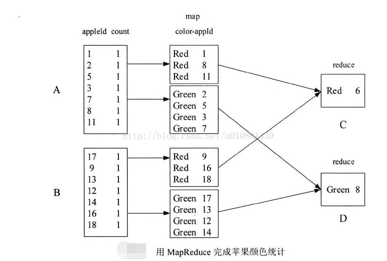
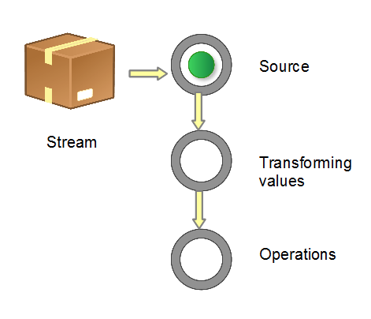

CMS系统学习，MapReduce思想学习,对Java8中对新特性stream，map和reduce进行学习

<!-- more -->
# 任务
先阅读cn.creditease.bdp.newcms.notice源码，定时相关，其中impl/CmsTaskNoticeHelperImpl/sendMsgByBatch函数是模块入口

阅读cn.creditease.bdp.newcms.cmswrapper.controller.PaymentScheduleController的源码，涉及到customer表，里面是借贷用户的信息

需求：CMS逾期天数计算方式优化

# 系统介绍

最早的site系统，scala语言，编译运行比较慢，一小时左右，包括了application，postloan等所有系统

测试官网网址：http://shangtongdai.yxapp.xyz/newsite/?code=YANGKAI34#/loginReg/login

查询语句：

    select * from shangtongdai.users
        where id in (
          select user_id from shangtongdai.applications
              where id in (
                    select application_id from shangtongdai.loans
                          where loan_status_id=12 ))

application系统：进件系统

巨星系统：数据中转

爬虫系统：爬取商户数据

miner系统：评级系统

postloan系统（贷后系统）

User系统：管理用户

User-refer系统：返还佣金

Report系统：做报表

Report-tool系统：基础查询

综合信贷系统：管理合同签约

新核心系统：管理还款计划表

结算系统：管理还款逻辑

添加店户会触发爬虫系统，爬取商户的数据，使用miner系统进行评级，巨星系统进行数据中转筛除。

评级通过之后，进件将由CMS系统进行审核，审核通过后，所有审核逻辑都在CMS系统中。

审核通过后，由postloan系统（贷后系统）处理，包括了：

1.合同管理：签约，管理状态,综合信贷系统管理合同签约

2.还款：还款计划表,新核心系统管理还款计划表

3.放款：结算系统管理还款逻辑

团队主要负责CMS，postloan和report，report-tool等系统。

application进件系统，爬虫系统，巨星系统，miner评级系统由进件团队负责。

CMS系统里有初审，复审，分发等36个状态。

***shangtongdai数据库表信息：***

transport表：进件表，维护进件状态，

transportlabel拒绝或接受打下标签

transportext 进件附加信息，以json格式存储（最重要）

transport_decisions:重大决策信息放款或其它

transport_assigned_history：客服分单给客户历史的信息

loan :合同

repayment：业务订单，用户还款会生成业务订单

loanrepayment：合同和业务订单的关系，一笔合同会有多笔订单

repayment_type字段，还款类型

repayment_order字段：

repaymenttags:业务订单信息

权限信息的相关表
privilege
role
role_privilege
user_role

任务相关的表
tb_cron_ini
cms_task

# MapReduce思想及Java中的实现

MapReduce源于Google一篇论文，它充分借鉴了分而治之的思想，将一个数据处理过程拆分为主要的Map(映射)与Reduce(化简)两步。用户不懂分布式计算框架的内部运行机制，只要能用Map和Reduce的思想描述清楚要处理的问题，即编写map()和reduce( )函数，就能轻松地使问题的计算实现分布式，并在Hadoop上运行。MapReduce的编程具有以下特点。

## 开发简单:
得益于MapReduce的编程模型，用户可以不用考虑进程间通信、套接字编程，无需非常高深的技巧，只需要实现一些非常简单的逻辑，其他的交由MapReduce计算框架去完成，大大简化了分布式程序的编写难度。
## 可扩展性强:
同HDFS一样，当集群资源不能满足计算需求时，可以通过增加节点的方式达到线性扩展集群的目的。
## 容错性强:
对于节点故障导致的作业失败，MapReduce计算框架会自动将作业安排到健康节点重新执行，直到任务完成，而这些，对于用户来说都是透明的。

## MapReduce的编程思想

Map(映射)与Reduce(化简)来源于LISP和其他函数式编程语言中的古老的映射和化简操作，MapReduce操作数据的最小单位是一个键值对。用户在使用MapReduce编程模型的时候，第一步就需要将数据抽象为键值对的形式，接着***map函数*** 会以键值对作为输入，经过map函数的处理，产生一系类新的键值对作为中间结果输出到本地。MapReduce计算框架会自动将这些中间结果数据按照键做聚合处理，并将键相同的数据分发给reduce函数处理(用户可以设置分发规则)。***reduce函数*** 以键和对应的值的集合作为输入，经过reduce函数的处理后，产生了另外一系列键值对作为最终输出。

如果用表达式表示，其过程如下式所示 :

    {Keyl，Value1}~{Key2, List<Value2>}~{Key3, Value3}
读者可能觉得上面的描述和表达式非常抽象，那么让我们先来看一个例子。有一篮苹果，一些是红苹果，一些是青苹果，每个苹果有一个唯一编号，要解决的问题是统计该篮苹果的数目、红苹果(深色)的个数和青苹果(浅色)的个数。

  假设有A, B, C三个人，A获得第一排苹果，B获得第二排苹果，这时，A和B分别统计自己手上的苹果的个数，然后将结果告知C, C将A, B的结果做一次汇总，得到最后结果。对于这个过程，其实用到了MapReduce的思想。我们可以从下一幅图看出端倪。

A的map函数的输入的格式为键值对appleId-count，比女fl " 11-1”表示appleId为11的苹果个数为1，经过map函数的累和，即将所有appleId的count相加，输出为新的键值对AppleCount-6，此时B也进行同样的操作，由于A和B的map函数输出的键值对的键相同，都为“AppleCount"，所以MapReduce框架会将其都分发到C作为reduce函数的输入，并在reduce函数中完成对键相同的值的累和，并输出最后结果AppleCount-12。如果用表达式表示，即为:

    (appleId, count}一>(AppleCount，List<count>}一>{AppleCount，count}

在这个例子中，就是用MapReduce的思想来完成苹果计数的问题，细心的读者可能发现，这个例子中reduce函数只执行了一次，是否可以执行多次呢，答案是肯定的，下面来看用MapReduce思想解决对红苹果和青苹果分别计数的问题。

假设有A, B. C, D四个人，A获得第一排苹果，B获得第二排苹果，A将手上的红苹果给C、青苹果给D、B将手上的红苹果给C、青苹果给D。C, D再统计各自手上的结果，得到最后结果，如下图所示。

A的map函数的输入同上次一样，在map函数中，用color和appleId作为新的键值对重新输出，B也做同样的操作。而A, B的map函数的输出的键值对会因为不同的键被分别分发到C和D执行:reduce函数，而真正的计数是由reduce函数完成，并输出最后结果。这里:reduce函数一共执行了两次，第一次是处理键为Red的数据.第二次是处理键为Green的数据。如果用表达式表示，即为:

    {appleId, count}~{color, List<appleId>}~{color, count}

要理解MapReduce的编程思想，其核心的一点就是将数据用键值对表示。在现实生活中，很多数据要么本身就为键值对的形式，要么可以用键值对这种方式来表示，例如电话号码和通话记录，文件名和文件存储的数据等，键值对并不是高端数据挖掘独有的数据模型，而是存在于我们身边非常普通的模型。

利用分而治之的思想，可以将很多复杂的数据分析问题转变为一系列MapReduce作业，利用Hadoop的提供MapReduce计算框架，实现分布式计算，这样就能对海量数据进行复杂的数据分析，这也是MapReduce的意义所在。
# Java8 中的Stream
Java 8 中的 Stream 是对集合（Collection）对象功能的增强，它专注于对集合对象进行各种非常便利、高效的聚合操作（aggregate operation），或者大批量数据操作 (bulk data operation)。Stream API 借助于同样新出现的 Lambda 表达式，极大的提高编程效率和程序可读性。同时它提供串行和并行两种模式进行汇聚操作，并发模式能够充分利用多核处理器的优势，使用 fork/join 并行方式来拆分任务和加速处理过程。通常编写并行代码很难而且容易出错, 但使用 Stream API 无需编写一行多线程的代码，就可以很方便地写出高性能的并发程序。所以说，Java 8 中首次出现的 java.util.stream 是一个函数式语言+多核时代综合影响的产物。

## 什么是聚合操作

在传统的 J2EE 应用中，Java 代码经常不得不依赖于关系型数据库的聚合操作来完成诸如：

客户每月平均消费金额

最昂贵的在售商品

本周完成的有效订单（排除了无效的）

取十个数据样本作为首页推荐

这类的操作。

但在当今这个数据大爆炸的时代，在数据来源多样化、数据海量化的今天，很多时候不得不脱离 RDBMS，或者以底层返回的数据为基础进行更上层的数据统计。而 Java 的集合 API 中，仅仅有极少量的辅助型方法，更多的时候是程序员需要用 Iterator 来遍历集合，完成相关的聚合应用逻辑。这是一种远不够高效、笨拙的方法。在 Java 7 中，如果要发现 type 为 grocery 的所有交易，然后返回以交易值降序排序好的交易 ID 集合，我们需要这样写：

### Java 7 的排序、取值实现

    List<Transaction> groceryTransactions = new Arraylist<>();
    for(Transaction t: transactions){
     if(t.getType() == Transaction.GROCERY){
     groceryTransactions.add(t);
     }
    }
    Collections.sort(groceryTransactions, new Comparator(){
     public int compare(Transaction t1, Transaction t2){
     return t2.getValue().compareTo(t1.getValue());
     }
    });
    List<Integer> transactionIds = new ArrayList<>();
    for(Transaction t: groceryTransactions){
     transactionsIds.add(t.getId());
    }

而在 Java 8 使用 Stream，代码更加简洁易读；而且使用并发模式，程序执行速度更快。

### Java 8 的排序、取值实现

    List<Integer> transactionsIds = transactions.parallelStream().
     filter(t -> t.getType() == Transaction.GROCERY).
     sorted(comparing(Transaction::getValue).reversed()).
     map(Transaction::getId).
     collect(toList());

##  Stream总览

### 什么是流
Stream 不是集合元素，它不是数据结构并不保存数据，它是有关算法和计算的，它更像一个高级版本的 Iterator。原始版本的 Iterator，用户只能显式地一个一个遍历元素并对其执行某些操作；高级版本的 Stream，用户只要给出需要对其包含的元素执行什么操作，比如 “过滤掉长度大于 10 的字符串”、“获取每个字符串的首字母”等，Stream 会隐式地在内部进行遍历，做出相应的数据转换。

Stream 就如同一个迭代器（Iterator），单向，不可往复，数据只能遍历一次，遍历过一次后即用尽了，就好比流水从面前流过，一去不复返。

而和迭代器又不同的是，Stream 可以并行化操作，迭代器只能命令式地、串行化操作。顾名思义，当使用串行方式去遍历时，每个 item 读完后再读下一个 item。

而使用并行去遍历时，数据会被分成多个段，其中每一个都在不同的线程中处理，然后将结果一起输出。

Stream 的并行操作依赖于 Java7 中引入的 Fork/Join 框架（JSR166y）来拆分任务和加速处理过程。Java 的并行 API 演变历程基本如下：

1.0-1.4 中的 java.lang.Thread

5.0 中的 java.util.concurrent

6.0 中的 Phasers 等

7.0 中的 Fork/Join 框架

8.0 中的 Lambda

Stream 的另外一大特点是，数据源本身可以是无限的。

### 流的构成

当我们使用一个流的时候，通常包括三个基本步骤：

获取一个数据源（source）→ 数据转换→执行操作获取想要的结果，每次转换原有 Stream 对象不改变，返回一个新的 Stream 对象（可以有多次转换），这就允许对其操作可以像链条一样排列，变成一个管道，如下图所示。

图1:流管道 (Stream Pipeline) 的构成

有多种方式生成 Stream Source：

#### 从 Collection 和数组

Collection.stream()

Collection.parallelStream()

Arrays.stream(T array) or Stream.of()

#### 从 BufferedReader
java.io.BufferedReader.lines()

#### 静态工厂
java.util.stream.IntStream.range()
java.nio.file.Files.walk()

#### 自己构建
java.util.Spliterator

#### 其它
Random.ints()

BitSet.stream()

Pattern.splitAsStream(java.lang.CharSequence)

JarFile.stream()

***流的操作类型分为两种：***

***Intermediate：***

一个流可以后面跟随零个或多个 intermediate 操作。其目的主要是打开流，做出某种程度的数据映射/过滤，然后返回一个新的流，交给下一个操作使用。这类操作都是惰性化的（lazy），就是说，仅仅调用到这类方法，并没有真正开始流的遍历。

***Terminal：***

一个流只能有一个 terminal 操作，当这个操作执行后，流就被使用“光”了，无法再被操作。所以这必定是流的最后一个操作。Terminal 操作的执行，才会真正开始流的遍历，并且会生成一个结果，或者一个 side effect。

在对于一个 Stream 进行多次转换操作 (Intermediate 操作)，每次都对 Stream 的每个元素进行转换，而且是执行多次，这样时间复杂度就是 N（转换次数）个 for 循环里把所有操作都做掉的总和吗？其实不是这样的，转换操作都是 lazy 的，多个转换操作只会在 Terminal 操作的时候融合起来，一次循环完成。

我们可以这样简单的理解，Stream 里有个操作函数的集合，每次转换操作就是把转换函数放入这个集合中，在 Terminal 操作的时候循环 Stream 对应的集合，然后对每个元素执行所有的函数。

还有一种操作被称为 ***short-circuiting***。用以指：

对于一个 intermediate 操作，如果它接受的是一个无限大（infinite/unbounded）的 Stream，但返回一个有限的新 Stream。

对于一个 terminal 操作，如果它接受的是一个无限大的 Stream，但能在有限的时间计算出结果。

当操作一个无限大的 Stream，而又希望在有限时间内完成操作，则在管道内拥有一个 short-circuiting 操作是必要非充分条件。

### 一个流操作的示例

    int sum = widgets.stream()
    .filter(w -> w.getColor() == RED)
     .mapToInt(w -> w.getWeight())
     .sum();

stream() 获取当前小物件的 source，filter 和 mapToInt 为 intermediate 操作，进行数据筛选和转换，最后一个 sum() 为 terminal 操作，对符合条件的全部小物件作重量求和。
## 流的使用详解
简单说，对 Stream 的使用就是实现一个 filter-map-reduce 过程，产生一个最终结果，或者导致一个副作用（side effect）。

流的构造与转换

下面提供最常见的几种构造 Stream 的样例。

### 构造流的几种常见方法

    // 1. Individual values
    Stream stream = Stream.of("a", "b", "c");
    // 2. Arrays
    String [] strArray = new String[] {"a", "b", "c"};
    stream = Stream.of(strArray);
    stream = Arrays.stream(strArray);
    // 3. Collections
    List<String> list = Arrays.asList(strArray);
    stream = list.stream();

需要注意的是，对于基本数值型，目前有三种对应的包装类型 Stream：

IntStream、LongStream、DoubleStream。

当然我们也可以用 Stream<Integer>、Stream<Long> >、Stream<Double>，但是 boxing 和 unboxing 会很耗时，所以特别为这三种基本数值型提供了对应的 Stream。

Java 8 中还没有提供其它数值型 Stream，因为这将导致扩增的内容较多。而常规的数值型聚合运算可以通过上面三种 Stream 进行。
### 数值流的构造
    IntStream.of(new int[]{1, 2, 3}).forEach(System.out::println);
    IntStream.range(1, 3).forEach(System.out::println);
    IntStream.rangeClosed(1, 3).forEach(System.out::println);

### 流转换为其它数据结构
    // 1. Array
    String[] strArray1 = stream.toArray(String[]::new);
    // 2. Collection
    List<String> list1 = stream.collect(Collectors.toList());
    List<String> list2 = stream.collect(Collectors.toCollection(ArrayList::new));
    Set set1 = stream.collect(Collectors.toSet());
    Stack stack1 = stream.collect(Collectors.toCollection(Stack::new));
    // 3. String
    String str = stream.collect(Collectors.joining()).toString();

一个 Stream 只可以使用一次，上面的代码为了简洁而重复使用了数次。

# Java8中的map和reduce

# 参考资料
【1】
https://blog.csdn.net/weixin_34112900/article/details/93630203

【2】https://www.ibm.com/developerworks/cn/java/j-lo-java8streamapi/index.html
