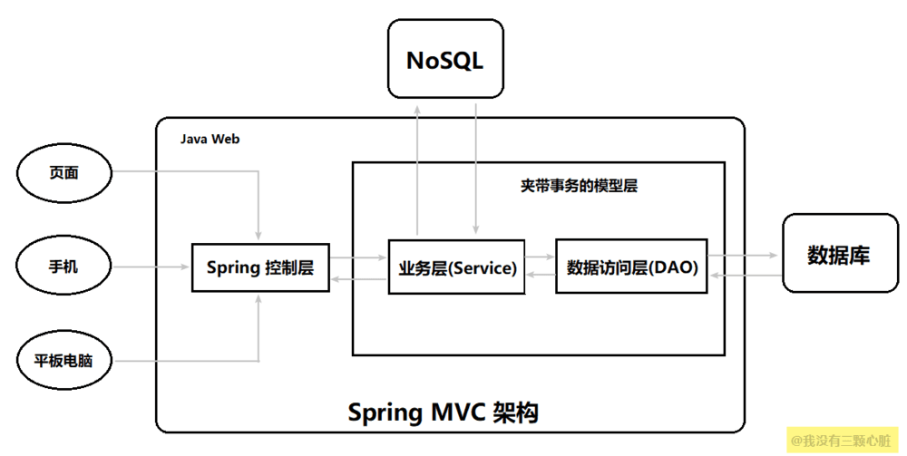

介绍了SpringMVC的基本概念和HTTP中Get与POST的区别。

<!-- more -->

# 原理详解

## SpringMVC是什么
早期 Java Web 的开发中，统一把显示层、控制层、数据层的操作全部交给 JSP 或者 JavaBean 来进行处理，我们称之为 Model1：

出现的弊端：

1.JSP 和 Java Bean 之间严重耦合，Java 代码和 HTML 代码也耦合在了一起

2.要求开发者不仅要掌握 Java ，还要有高超的前端水平

3.前端和后端相互依赖，前端需要等待后端完成，后端也依赖前端完成，才能进行有效的测试

4.代码难以复用

正因为上面的种种弊端，所以很快这种方式就被 Servlet + JSP + Java Bean 所替代了，早期的 MVC 模型（Model2）就像下图这样：

首先用户的请求会到达 Servlet，然后根据请求调用相应的 Java Bean，并把所有的显示结果交给 JSP 去完成，这样的模式我们就称为 MVC 模式。

M 代表 模型（Model）
模型是什么呢？ 模型就是数据，就是 dao,bean

V 代表 视图（View）
视图是什么呢？ 就是网页, JSP，用来展示模型中的数据

C 代表 控制器（controller)
控制器是什么？ 控制器的作用就是把不同的数据(Model)，显示在不同的视图(View)上，Servlet 扮演的就是这样的角色。
### Spring MVC 的架构

为解决持久层中一直未处理好的数据库事务的编程，又为了迎合 NoSQL 的强势崛起，Spring MVC 给出了方案

传统的模型层被拆分为了业务层(Service)和数据访问层（DAO,Data Access Object）。 在 Service 下可以通过 Spring 的声明式事务操作数据访问层，而在业务层上还允许我们访问 NoSQL ，这样就能够满足异军突起的 NoSQL 的使用了，它可以大大提高互联网系统的性能。

特点：

1.结构松散，几乎可以在 Spring MVC 中使用各类视图

2.松耦合，各个模块分离

3.与 Spring 无缝集成

## HTTP中GET与POST的区别
首先我们要清楚GET和POST是什么？

Get和Post是两种Http请求方式：

***GET-从指定的资源请求数据***

***POST-向指定的资源提交要被处理的数据***

GET 和 POST 其实都是 HTTP 的请求方法。除了这 2 个请求方法之外，HTTP 还有 HEAD、PUT、DELETE、TRACE、CONNECT、OPTIONS 这 6 个请求方法。所以HTTP 的请求方法共计有 8 种。这些请求的描述如下所示：

其它HTTP请求方法

| 方法    | 描述                                                                 |
| ------- | -------------------------------------------------------------------- |
| HEAD    | 与GET类似，但只获取HTTP报头，返回的响应中没有文档主体                |
| PUT     | 从客户端向服务器传送的数据取代指定的文档的内容                       |
| DELETE  | 请求服务器删除指定资源                                               |
| TRACE   | 回显服务器收到的请求，主要用于测试或诊断                             |
| CONNECT | HTTP/1.1协议中预留给能够把请求连接转换到透明的TCP/IP通道的代理服务器 |
| OPTIONS | 返回服务器支持的HTTP方法                                             |
| GET     | 请求指定的页面信息，并返回实体主体。                                 |
|   POST     |   向指定资源提交数据进行处理请求（例如提交表单或者上传文件）。数据被包含在请求体中。POST请求可能会导致新的资源的建立和/或已有资源的修改。 |

### GET方法
查询字符串（名称/值对）是在GET请求的URL中发送的，即请求的数据会附在 URL 之后（放在请求行中），以 ? 分割 URL 和传输数据，多个参数用 & 连接：

    http://localhost:8080/Merchant/SelectByMerchantNo?name1=value1&name2=value2

GET 请求可被缓存，如果下一次传输的数据相同，那么就会返回缓存中的内容，以求更快地展示数据。

GET 请求保留在浏览器历史记录中

GET 请求可被收藏为书签

GET 请求不应在处理敏感数据时使用

GET 请求有长度限制，但是需要注意的是 HTTP 协议中并未规定 GET 请求的长度。这个长度限制主要是由浏览器和 Web 服务器所决定的，并且各个浏览器对长度的限制也各不相同。

GET 请求只应当用于取回数据

GET 方法只产生一个 TCP 数据包，浏览器会把请求头和请求数据一并发送出去，服务器响应 200 ok(返回数据)

根据 HTTP 规范，GET 用于信息获取，而且应该是安全和幂等的 。

***安全性*** 指的是非修改信息，即该操作用于获取信息而非修改信息。换句话说，GET请求一般不应产生副作用，也就是说，它仅仅是获取资源信息，就像数据库查询一样，不会修改，增加数据，不会影响资源的状态。

***幂等性 (Idempotence)*** 则指的是无论调用这个URL 多少次，都不会有不同的结果的 HTTP 方法。而在实际过程中，这个规定没有那么严格。例如在一个新闻应用中，新闻站点的头版不断更新，虽然第二次请求会返回不同的一批新闻，该操作仍然被认为是安全的和幂等的，因为它总是返回当前的新闻。

### POST方法

查询字符串（名称/值对）是在 POST 请求的 HTTP 消息主体中发送的：

    POST /test/demo_form.asp HTTP/1.1
    Host: w3schools.com
    name1=value1&name2=value2

POST 请求不会被缓存

POST 请求不会保留在浏览器历史记录中

POST 不能被收藏为书签

根据 HTTP 规范，POST 表示可能修改变服务器上的资源的请求。例如我们在刷知乎的时候对某篇文章进行点赞，就是提交的 POST 请求，因为它改变了服务器中的数据（该篇文章的点赞数）。

POST 方法因为有可能修改服务器上的资源，所以它是不符合安全和幂等性的。

POST 是将请求信息放置在请求数据中的，这也是 POST 和 GET 的一点不那么重要的区别。有一些博客的说法是 GET 请求的请求信息是放置在 URL 的而 POST 是放置在请求数据中的所以 POST 比 GET 更安全。其实这种说法有待商榷，抓下包 POST 中的请求报文就暴露了，所以POST也不算安全？

因为 POST 方法的请求信息是放置在请求数据中的，所以它的请求信息是没有长度限制的。

POST 方法会产生两个 TCP 数据包，浏览器会先将请求头发送给服务器，待服务器响应100 continue，浏览器再发送请求数据，服务器响应200 ok(返回数据)。这么看起来 GET 请求的传输会比 POST 快上一些（因为GET 方法只发送一个 TCP 数据包），但是实际上在网络良好的情况下它们的传输速度基本相同。

## GET与POST的异同

|                  | Get                               | POST                                                                                 |
| ---------------- | --------------------------------- | ------------------------------------------------------------------------------------ |
| 后退按钮/刷新    | 无害                              | 数据会被重新提交（浏览器应该告知用户数据会被重新提交                                 |
| 书签             | 可收藏为书签                      | 不可收藏为书签                                                                       |
| 缓存             | 能被缓存                          | 不能缓存                                                                             |
| 编码类型         | application/x-www-form-urlencoded | application/x-www-form-urlencoded 或 multipart/form-data。为二进制数据使用多重编码。 |
| 历史             | 参数保留在浏览器历史中            | 参数不会保留在浏览器历史中                                                           |
| 对数据长度的限制 | 只允许ASCII字符                   | 没有限制，也允许二进制数据                                                           |
| 安全性           | 较差，因为发送的数据是URL的一部分 | POST比GET更安全，因为参数不会被保留在浏览器历史或WEB服务器日志中                     |
| 可见性           | 数据在URL中对所有人都是可见的     | 数据不会显示在URL中  |

上面说了那么多 GET 方法和 POST 方法各自的特点，它们在外在的表现上似乎是有着诸多的不同，但是实际上，它们的本质是一样的，并无区别。

它们都是 HTTP 请求协议的请求方法，而 HTTP 又是基于TCP/IP的关于数据如何在万维网中如何通信的协议，所以 GET/POST 实际上都是 TCP 链接。

也就是说，GET 和 POST 所做的事其实是一样的，如果你给 GET 加上请求数据，给 POST 加上 URL 参数，这在技术上是完全可行的，事实上确实有一些人为了贪图方便在更新资源时用了GET，因为用POST必须要到FORM（表单），这样会麻烦一点（但是强烈不建议这样子做！！！）。

既然 GET 和 POST 的底层都是 TCP，那么为什么 HTTP 还要特别将它们区分出来呢？

其实可以想象一下，如果我们直接使用 TCP 进行数据的传输，那么无论是单纯获取资源的请求还是修改服务器资源的请求在外观上看起来都是 TCP 链接，这样就非常不利于进行管理。所以在 HTTP 协议中，就会对这些不同的请求设置不同的类别进行管理，例如单纯获取资源的请求就规定为 GET、修改服务器资源的请求就规定为 POST，并且也对它们的请求报文的格式做出了相应的要求（例如请求参数 GET 位于 URL 而 POST 则位于请求数据中）。

当然，如果我们想将 GET 的请求参数放置在请求数据中或者将 POST 的请求数据放置在 URL 中，这是完全可以的，虽然这样子做并不符合 HTTP 的规范。但是这样子做是否能得到我们期望的响应数据呢？答案是未必，这取决于服务器的行为。

以 GET 方法在请求数据中放置请求参数为例，有些服务器会将请求数据中的参数读出，在这种情况下我们依然能获得我们期望的响应数据；而有些服务器则会选择直接忽略，这种情况下我们就无法获取期望的响应数据了。

所以，对于 GET 和 POST 的区别，总结来说就是：它们的本质都是 TCP 链接，并无区别。但是由于 HTTP 的规定以及浏览器/服务器的限制，导致它们在应用过程中可能会有所不同。

# 参考资料：
【1】https://www.jianshu.com/p/91a2d0a1e45a
【2】https://blog.csdn.net/qq_38182125/article/details/89071899
