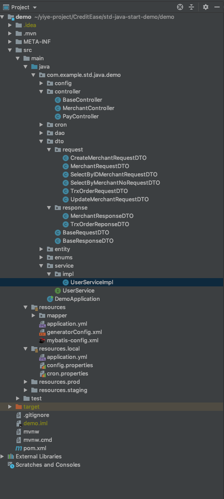

简单总结SpringMVC整合Mybatis，从Get/Request请求中实现对数据库的增删改查，对应着SpringBoot学习笔记II中的Mybatis任务中的第二项。

<!-- more -->

# 建立项目步骤

## Controller
在主目录下（com.example.std.java.demo）下建立Controller包，在controller下建立与表对应的controller

    package com.example.std.java.demo.controller;
    import com.example.std.java.demo.dto.request.*;
    import com.example.std.java.demo.dto.response.MerchantResponseDTO;
    import com.example.std.java.demo.entity.TblMerchantEntity;
    import com.example.std.java.demo.service.UserService;
    import org.springframework.beans.factory.annotation.Autowired;
    import org.springframework.web.bind.annotation.*;

    /*
    * @Description: 商户接口
    * @Author:yiye.li
    * @Date:2019-07-28
    */

    @RestController
    @RequestMapping("/Merchant")

    public class MerchantController extends BaseController{

    @Autowired
    UserService userService;

    /*
     *商户接口
     * 1。注册商户
     * http://localhost:8080//Merchant/CreateMerchant Postman中Get内容，其余内容可以在Params中填写
     * 使用@RequestBody格式则需在GET中的Body-》raw中以JSON串格式填写(注意在最右面的一栏中选择JSON(application/json))
     * @param MerchantRequestDTO
     * @return
     */

    @GetMapping("/CreateMerchant")
    public MerchantResponseDTO CreateMerchant(@RequestBody CreateMerchantRequestDTO createMerchantRequestDTO)
    {
        TblMerchantEntity tblMerchantEntity=new TblMerchantEntity();
        tblMerchantEntity.setMerchantName(createMerchantRequestDTO.getMerchantName());
        tblMerchantEntity.setContactName(createMerchantRequestDTO.getContactName());
        tblMerchantEntity.setPlatformKey(createMerchantRequestDTO.getPlatformKey());
        tblMerchantEntity.setShortName(createMerchantRequestDTO.getShortName());
        MerchantResponseDTO merchantResponseDTO;

        merchantResponseDTO=userService.MybatisCreateMerchant(tblMerchantEntity);
        return merchantResponseDTO;

    }

    /*
     *商户接口
     * 2。根据商编查询商户
     * http://localhost:8080//Merchant/SelectByMerchantNo Postman中Get内容，其余内容可以在Params中填写
     * @param MerchantRequestDTO
     * @return
     */

    @GetMapping("/SelectByMerchantNo")
    public MerchantResponseDTO SelectByMerchantNo(@RequestBody SelectByMerchantNoRequestDTO selectByMerchantNoRequestDTO)
    {
        TblMerchantEntity tblMerchantEntity=new TblMerchantEntity();
        tblMerchantEntity.setMerchantNo(selectByMerchantNoRequestDTO.getMerchantNo());
        MerchantResponseDTO merchantResponseDTO;
        merchantResponseDTO=userService.MybatisSelectByMerchantNo(tblMerchantEntity);
        return merchantResponseDTO;

    }

    /*
     *商户接口
     * 3。修改商户状态
     * http://localhost:8080//Merchant/UpdateMerchantStatus Postman中Get内容，其余内容可以在Params中填写
     * @param MerchantRequestDTO
     * @return
     */

    @GetMapping("/UpdateMerchantStatus")
    public MerchantResponseDTO UpdateMerchantStatus(@RequestBody UpdateMerchantRequestDTO updateMerchantRequestDTO)
    {
        TblMerchantEntity tblMerchantEntity=new TblMerchantEntity();
        tblMerchantEntity.setId(updateMerchantRequestDTO.getId());

        MerchantResponseDTO merchantResponseDTO;
        merchantResponseDTO=userService.MybatisUpdateMerchantStatus(tblMerchantEntity);
        return merchantResponseDTO;

    }

    /*
     *商户接口
     * 4。从外部能够查询商户(根据ID查询商户)
     * http://localhost:8080//Merchant/MerchantQuery Postman中Get内容，其余内容可以在Params中的KEY和VALUE填写
     * @param MerchantRequestDTO
     * @return
     */

    @GetMapping("/MerchantQuery")
    public MerchantResponseDTO MerchantQuery(@RequestBody SelectByIDMerchantRequestDTO selectByIDMerchantRequestDTO)
    {
        TblMerchantEntity tblMerchantEntity=new TblMerchantEntity();
        tblMerchantEntity.setId(selectByIDMerchantRequestDTO.getId());
        MerchantResponseDTO merchantResponseDTO;

        merchantResponseDTO=userService.MybatisSpringQuery(tblMerchantEntity);
        return merchantResponseDTO;

    }
    /*    //4。从外部能够查询商户(根据ID查询商户)
    //http://localhost:8080//Merchant/MerchantQuery Postman中Get内容，其余内容可以在Params中的KEY和VALUE填写
    @GetMapping("/MerchantQuery")
    public MerchantResponseDTO MerchantQuery(@RequestParam("merchantName") String merchantName,
                                        @RequestParam("contactName") String contactName,
                                        @RequestParam("contactPhone")  String contactPhone,
                                        @RequestParam("platformKey") String platformKey,
                                        @RequestParam("shortName") String shortName)
    {
        MerchantResponseDTO merchantResponseDTO=new MerchantResponseDTO();

        merchantResponseDTO=userService.MybatisSpringQuery(40L);
        return merchantResponseDTO;

    }*/
    }

## DTO

### RequestDTO

在主目录下建立dto包，再分别建立子目录request和response，request下建立相应的requestDTO文件，每个文件中对应着HTTP请求中相应的参数，而response下建立相应的responseDTO文件，其中对应着要返回的参数

如SelectByIDMerchantRequestDTO.class

    package com.example.std.java.demo.dto.request;
    import java.io.Serializable;
    import lombok.Data;

    /**
    * @Description: 商户dto
    * @Author: yiye.li
    * @Date: 2019-07-29 10:45
    */
    @Data
    public class SelectByIDMerchantRequestDTO {
      /**
       * 商户ID
       */
      private Long id;
    }

再如CreateMerchantRequestDTO.class文件

    package com.example.std.java.demo.dto.request;
    import java.io.Serializable;
    import lombok.Data;

    /**
     * @Description: 商户dto
     * @Author: yiye.li
     * @Date: 2019-07-29 10:45
     */
    @Data
    public class CreateMerchantRequestDTO {
        /**
         * 商户名称
         */
        private String merchantName;

        /**
         * 联系人姓名
         */
        private String contactName;

        /**
         * 联系电话
         */
        private String contactPhone;

        /**
         * 平台钥匙
         */
        private String platformKey;
        /**
         * 简称
         */
        private String shortName;
    }

### ReponseDTO

ReponseDTO中写相应的返回参数，例如：

    package com.example.std.java.demo.dto.response;

    import lombok.Data;

    import java.util.Date;

    /**
     * @Description: 商户返回dto
     * @Author: yiye.li
     * @Date: 2019-07-29 10:45
     */
    @Data
    public class MerchantResponseDTO {
        //可以自选返回什么

        /**
         * ID
         */
        private long ID;

        /**
         * CREATE_TIME
         */
        private Date createTime;

        /**
         * 上次更新时间
         */
        private Date lastUpdateTime;

        /**
         * 商户编号
         */
        private String merchantNo;

        /**
         * 商户名称
         */
        private String merchantName;

        /**
         * 联系人姓名
         */
        private String contactName;

        /**
         * 联系电话
         */
        private String contactPhone;

        /**
         * 平台钥匙
         */
        private String platformKey;
        /**
         * 商户状态
         */
        private String status;

        /**
         * 简称
         */
        private String shortName;

        /**
         * 组
         */
        private String checkGroup;
    }

## Service
在主目录下建立Service包，其中建立Service文件中声明方法名和参数，再建立impl包，其中的ServiceImpl文件来实现对HTTP请求相应的处理方法

UserService.class文件

    package com.example.std.java.demo.service;

    import com.example.std.java.demo.dto.response.MerchantResponseDTO;
    import com.example.std.java.demo.entity.TblMerchantEntity;

    public interface UserService {

        String test();

        /**
         * 创建商户
         * @param tblMerchantEntity
         * @return
         */
        MerchantResponseDTO MybatisCreateMerchant(TblMerchantEntity tblMerchantEntity);

        /**
         * 根据商编查询商户
         * @param tblMerchantEntity
         * @return
         */
        MerchantResponseDTO MybatisSelectByMerchantNo(TblMerchantEntity tblMerchantEntity);

        /**
         *
         * @param tblMerchantEntity
         * @return
         */
        MerchantResponseDTO MybatisUpdateMerchantStatus(TblMerchantEntity tblMerchantEntity);

        /**
         *
         * @param tblMerchantEntity
         * @return
         */
        MerchantResponseDTO MybatisSpringQuery(TblMerchantEntity tblMerchantEntity);
    }

而impl文件中的UserServiceImpl.class文件如下：

    package com.example.std.java.demo.service.impl;
    import com.alibaba.fastjson.JSON;
    import com.example.std.java.demo.dao.TblMerchantEntityMapper;
    import com.example.std.java.demo.dto.response.MerchantResponseDTO;
    import com.example.std.java.demo.entity.TblMerchantEntity;
    import com.example.std.java.demo.entity.TblMerchantEntityExample;
    import com.example.std.java.demo.service.UserService;
    import lombok.extern.apachecommons.CommonsLog;
    import org.slf4j.Logger;
    import org.slf4j.LoggerFactory;
    import org.springframework.beans.factory.annotation.Autowired;
    import org.springframework.stereotype.Service;
    import org.springframework.util.CollectionUtils;

    import java.text.DateFormat;
    import java.text.ParseException;
    import java.text.SimpleDateFormat;
    import java.util.Date;
    import java.util.List;
    import java.util.Random;

    @Service
    public class UserServiceImpl implements UserService {

        private static final Logger logger= LoggerFactory.getLogger(UserServiceImpl.class);
        //要加一些事务处理
        //@Transcational (rollback=...

        @Override
        public String test() {
            return null;
        }

        @Autowired
        private TblMerchantEntityMapper tblMerchantEntityMapper;
    //create duplicate problem to solve

        @Override
        public MerchantResponseDTO MybatisCreateMerchant(TblMerchantEntity RequesttblMerchantEntity){
            MerchantResponseDTO merchantResponseDTO=new MerchantResponseDTO();
            TblMerchantEntity tblMerchantEntity=new TblMerchantEntity();
            //生成随机数
            Random random=new Random();
            int nextInt=random.nextInt(100000);
            long IDnum=nextInt;
            if(tblMerchantEntityMapper.selectByPrimaryKey(IDnum)==null) {

                tblMerchantEntity.setId(IDnum);

                try{
                    DateFormat format=new SimpleDateFormat("yyyyMMddHHmmss");
                    Date date =format.parse(System.currentTimeMillis()+"");
                    Date dateend =format.parse(System.currentTimeMillis()+24+"");
                    tblMerchantEntity.setCreateTime(date);
                    tblMerchantEntity.setLastUpdateTime(dateend);
                }catch(ParseException e){
                    e.printStackTrace();
                }
                tblMerchantEntity.setMerchantNo(""+nextInt);
                //set the new data from the requestDTO
                tblMerchantEntity.setMerchantName(RequesttblMerchantEntity.getMerchantName());
                tblMerchantEntity.setContactName(RequesttblMerchantEntity.getContactName());
                tblMerchantEntity.setContactPhone(RequesttblMerchantEntity.getContactPhone());
                tblMerchantEntity.setPlatformKey(RequesttblMerchantEntity.getPlatformKey());
                tblMerchantEntity.setShortName(RequesttblMerchantEntity.getShortName());

                tblMerchantEntity.setStatus("1");
                tblMerchantEntity.setCheckGroup("集贸市场");
                tblMerchantEntityMapper.insert(tblMerchantEntity);

                merchantResponseDTO.setID(tblMerchantEntity.getId());
                merchantResponseDTO.setCreateTime(tblMerchantEntity.getCreateTime());
                merchantResponseDTO.setLastUpdateTime(tblMerchantEntity.getLastUpdateTime());
                merchantResponseDTO.setMerchantNo(tblMerchantEntity.getMerchantNo());
                merchantResponseDTO.setMerchantName(tblMerchantEntity.getMerchantName());
                merchantResponseDTO.setContactName(tblMerchantEntity.getContactName());
                merchantResponseDTO.setContactPhone(tblMerchantEntity.getContactPhone());
                merchantResponseDTO.setPlatformKey(tblMerchantEntity.getPlatformKey());
                merchantResponseDTO.setStatus(tblMerchantEntity.getStatus());
                merchantResponseDTO.setShortName(tblMerchantEntity.getShortName());
                merchantResponseDTO.setCheckGroup(tblMerchantEntity.getCheckGroup());
                //将entity中的属性set到merchantResponseDTO中去

                System.out.println("*********Create by ID="+IDnum+"************");
            }else{
                System.out.println("*********Create The Record Failed, The record has already existed*************");
                tblMerchantEntity=tblMerchantEntityMapper.selectByPrimaryKey(IDnum);
                merchantResponseDTO.setID(tblMerchantEntity.getId());
                merchantResponseDTO.setCreateTime(tblMerchantEntity.getCreateTime());
                merchantResponseDTO.setLastUpdateTime(tblMerchantEntity.getLastUpdateTime());
                merchantResponseDTO.setMerchantNo(tblMerchantEntity.getMerchantNo());
                merchantResponseDTO.setMerchantName(tblMerchantEntity.getMerchantName());
                merchantResponseDTO.setContactName(tblMerchantEntity.getContactName());
                merchantResponseDTO.setContactPhone(tblMerchantEntity.getContactPhone());
                merchantResponseDTO.setPlatformKey(tblMerchantEntity.getPlatformKey());
                merchantResponseDTO.setStatus(tblMerchantEntity.getStatus());
                merchantResponseDTO.setShortName(tblMerchantEntity.getShortName());
                merchantResponseDTO.setCheckGroup(tblMerchantEntity.getCheckGroup());
            }
            return merchantResponseDTO;
        }

        @Override
        public MerchantResponseDTO MybatisSelectByMerchantNo(TblMerchantEntity RequesttblMerchantEntity){
            MerchantResponseDTO merchantResponseDTO= null;
            try {
                merchantResponseDTO = new MerchantResponseDTO();
                if(logger.isDebugEnabled()){
                    //debug 级别的日志
                    logger.debug("");
                }
                logger.info("query merchant info by merchantN={}",RequesttblMerchantEntity);
                //1。构建商户实体
                TblMerchantEntity tblMerchantEntity=new TblMerchantEntity();
                TblMerchantEntityExample tblMerchantEntityExample=new TblMerchantEntityExample();
                TblMerchantEntityExample.Criteria criteria=tblMerchantEntityExample.createCriteria();
                criteria.andMerchantNoEqualTo(RequesttblMerchantEntity.getMerchantNo());

                // 2。从数据库查询商户信息
                List<TblMerchantEntity> tblMerchantEntities = tblMerchantEntityMapper.selectByExample(tblMerchantEntityExample);
                // 判断如果查询的商户信息为空则抛出异常
                if(CollectionUtils.isEmpty(tblMerchantEntities)){
                    throw new RuntimeException("merchant is null");
                }else{
                    //如果查询的商户有重复则在日志中写入warn
                    if(tblMerchantEntities.size()>1) {
                        logger.warn("query merchant size ={}", tblMerchantEntities.size());
                    }
                    //获取第一个商户的信息
                    tblMerchantEntity=tblMerchantEntities.get(0);
                }

                //3。将entity中的属性set到merchantResponseDTO中去
                merchantResponseDTO.setID(tblMerchantEntity.getId());
                merchantResponseDTO.setCreateTime(tblMerchantEntity.getCreateTime());
                merchantResponseDTO.setLastUpdateTime(tblMerchantEntity.getLastUpdateTime());
                merchantResponseDTO.setMerchantNo(tblMerchantEntity.getMerchantNo());
                merchantResponseDTO.setMerchantName(tblMerchantEntity.getMerchantName());
                merchantResponseDTO.setContactName(tblMerchantEntity.getContactName());
                merchantResponseDTO.setContactPhone(tblMerchantEntity.getContactPhone());
                merchantResponseDTO.setPlatformKey(tblMerchantEntity.getPlatformKey());
                merchantResponseDTO.setStatus(tblMerchantEntity.getStatus());
                merchantResponseDTO.setShortName(tblMerchantEntity.getShortName());
                merchantResponseDTO.setCheckGroup(tblMerchantEntity.getCheckGroup());
                System.out.println("*********Select by MerchantNo="+tblMerchantEntity.getMerchantNo()+"************");
                System.out.println(JSON.toJSONString(tblMerchantEntity));
            } catch (RuntimeException e) {
                logger.error("system error ",e);
                throw e;
            }

            return merchantResponseDTO;
        }
        @Override
        public MerchantResponseDTO MybatisUpdateMerchantStatus(TblMerchantEntity RequesttblMerchantEntity){
            //制定要更新的ID
            long IDnum=RequesttblMerchantEntity.getId();
            TblMerchantEntity tblMerchantEntity=tblMerchantEntityMapper.selectByPrimaryKey(IDnum);

            MerchantResponseDTO merchantResponseDTO=new MerchantResponseDTO();
            TblMerchantEntityExample tblMerchantEntityExample=new TblMerchantEntityExample();
            TblMerchantEntityExample.Criteria criteria=tblMerchantEntityExample.createCriteria();
            criteria.andIdEqualTo(tblMerchantEntity.getId());

            tblMerchantEntity.setStatus("1");
            //set the new data from the requestDTO

            tblMerchantEntityMapper.updateByExample(tblMerchantEntity,tblMerchantEntityExample);

            merchantResponseDTO.setID(tblMerchantEntity.getId());
            merchantResponseDTO.setCreateTime(tblMerchantEntity.getCreateTime());
            merchantResponseDTO.setLastUpdateTime(tblMerchantEntity.getLastUpdateTime());
            merchantResponseDTO.setMerchantNo(tblMerchantEntity.getMerchantNo());
            merchantResponseDTO.setMerchantName(tblMerchantEntity.getMerchantName());
            merchantResponseDTO.setContactName(tblMerchantEntity.getContactName());
            merchantResponseDTO.setContactPhone(tblMerchantEntity.getContactPhone());
            merchantResponseDTO.setPlatformKey(tblMerchantEntity.getPlatformKey());
            merchantResponseDTO.setStatus(tblMerchantEntity.getStatus());
            merchantResponseDTO.setShortName(tblMerchantEntity.getShortName());
            merchantResponseDTO.setCheckGroup(tblMerchantEntity.getCheckGroup());
            System.out.println("*********Update by ID="+tblMerchantEntity.getId()+"************");
            System.out.println(JSON.toJSONString(tblMerchantEntity));

            return merchantResponseDTO;
        }
        @Override
        public MerchantResponseDTO MybatisSpringQuery(TblMerchantEntity RequesttblMerchantEntity){

            //1。获取对应信息
            long IDnum=RequesttblMerchantEntity.getId();

            MerchantResponseDTO merchantResponseDTO=new MerchantResponseDTO();
            //2。先从缓存中尝试获取数据

            //3。缓存无，从db中获取数据
            //注意是mybatis中自动生成的TblMerchantEntity而不是JPA中生成的实体TblMerchant
            TblMerchantEntity tblMerchantEntity=tblMerchantEntityMapper.selectByPrimaryKey(IDnum);

            //制定要更新的ID

            System.out.println("*********Query by ID="+IDnum+"************");
            merchantResponseDTO.setID(tblMerchantEntity.getId());
            merchantResponseDTO.setCreateTime(tblMerchantEntity.getCreateTime());
            merchantResponseDTO.setLastUpdateTime(tblMerchantEntity.getLastUpdateTime());
            merchantResponseDTO.setMerchantNo(tblMerchantEntity.getMerchantNo());
            //将Get请求中的信息set到ReponseDTO中去
            merchantResponseDTO.setMerchantName(tblMerchantEntity.getMerchantName());
            merchantResponseDTO.setContactName(tblMerchantEntity.getContactName());
            merchantResponseDTO.setContactPhone(tblMerchantEntity.getContactPhone());
            merchantResponseDTO.setPlatformKey(tblMerchantEntity.getPlatformKey());
            merchantResponseDTO.setStatus(tblMerchantEntity.getStatus());
            //
            merchantResponseDTO.setShortName(tblMerchantEntity.getShortName());
            merchantResponseDTO.setCheckGroup(tblMerchantEntity.getCheckGroup());

            //4。返回结果
            //将entity中的属性set到merchantResponseDTO中去
            return merchantResponseDTO;

        }
    }

其中的文件目录树如下：

# PostMan使用

PostMan软件可用于调试HTTP接口，具体使用方法不再赘述
只说需要注意的几点：
## @RequestParam
当controller中当方法参数为@RequestParam形式时

      //4。从外部能够查询商户(根据ID查询商户)
      //http://localhost:8080//Merchant/MerchantQuery Postman中Get内容，其余内容可以在Params中的KEY和VALUE填写
      @GetMapping("/MerchantQuery")
      public MerchantResponseDTO MerchantQuery(@RequestParam("merchantName") String merchantName,
                                          @RequestParam("contactName") String contactName,
                                          @RequestParam("contactPhone")  String contactPhone,
                                          @RequestParam("platformKey") String platformKey,
                                          @RequestParam("shortName") String shortName)
      {
          MerchantResponseDTO merchantResponseDTO=new MerchantResponseDTO();

          merchantResponseDTO=userService.MybatisSpringQuery(40L);
          return merchantResponseDTO;

      }

Postman中选择POST格式发送，http://localhost:8080/Merchant/MerchantQuery
然后在Params中填入KEY和VALUE，即可发送对应当POST请求。

## @RequestBody

如果controller中的方法参数为@RequestBody形式时:

    /*
    *商户接口
    * 4。从外部能够查询商户(根据ID查询商户)
    * http://localhost:8080//Merchant/MerchantQuery Postman中Get内容，其余内容可以在Params中的KEY和VALUE填写
    * @param MerchantRequestDTO
    * @return
    */

    @GetMapping("/MerchantQuery")
    public MerchantResponseDTO MerchantQuery(@RequestBody SelectByIDMerchantRequestDTO selectByIDMerchantRequestDTO)
    {
      TblMerchantEntity tblMerchantEntity=new TblMerchantEntity();
      tblMerchantEntity.setId(selectByIDMerchantRequestDTO.getId());
      MerchantResponseDTO merchantResponseDTO;

      merchantResponseDTO=userService.MybatisSpringQuery(tblMerchantEntity);
      return merchantResponseDTO;

    }

则选择Body形式，然后在右侧的栏中选择JSON(application/json)
以JSON格式填写POST中的Body：

    {
        "ID": "47943"
    }
