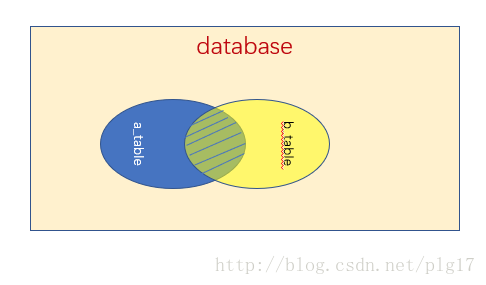
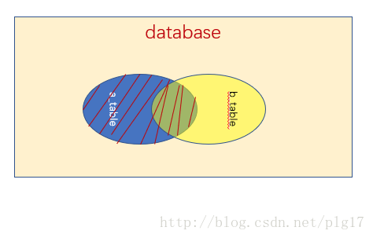
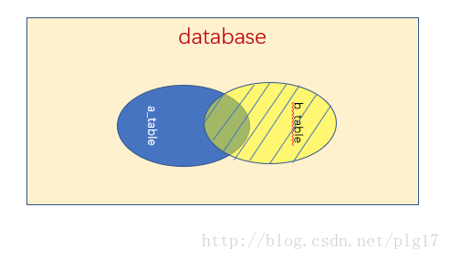

SQL中的连接

<!-- more -->

# SQL连接查询
连接查询是将两个或两个以上的表按某些条件连接起来，从中选取需要的数据。可以分为内连接查询(通过where实现)和外连接查询（join）[^1]。

## 自然连接（natural join）

自然连接(Natural join)是一种特殊的等值连接，要求两个关系表中进行比较的属性组必须是名称相同的属性组，并且在结果中把重复的属性列去掉（即：留下名称相同的属性组中的其中一组）。

自然连接sql语句：

    select * from A natrual join B 

自然连接将两个关系组中在相同名称的属性上具有相同的值的行记录进行匹配），并且重复的属性列去掉，这样新的一行将出现在查询结果中，而那些没被匹配的行不出现在结果中。因此自然连接的结果会有数据丢失，这些丢失的数据就是那些没有匹配的数据。

## 内连接查询
只有不同表中有相同意义的字段时才能进行连接，而且内连接查询只查询出指定字段取值相同的记录。

内连接（ [inner]  join）是从查询结果表中删除与其他被连接表中没有匹配行的所有行，所以内连接可能会丢失信息。注明，[inner]  join表示inner可以省略。

    一般语法:
    select a.* , b.*
    from table_a as a, table_b as b
    where a.id = b.id;

## 内连接和自然连接的区别

内部联接和自然联接之间的一个显著区别是返回的列数[^2][^3]。
    
    TableA                           TableB
    +------------+----------+        +--------------------+    
    |Column1     | Column2  |        |Column1  |  Column3 |
    +-----------------------+        +--------------------+
    | 1          |  2       |        | 1       |   3      |
    +------------+----------+        +---------+----------+
第1列的表A和表B的INNER JOIN将返回

    SELECT * FROM TableA INNER JOIN TableB USING (Column1);
    SELECT * FROM TableA INNER JOIN TableB ON TableA.Column1 = TableB.Column1;
    +------------+-----------+---------------------+    
    | a.Column1  | a.Column2 | b.Column1| b.Column3|
    +------------------------+---------------------+
    | 1          |  2        | 1        |   3      |
    +------------+-----------+----------+----------+

第1列表A和表B的NATURAL JOIN将返回：
    
    SELECT * FROM TableA NATURAL JOIN TableB
    +------------+----------+----------+    
    |Column1     | Column2  | Column3  |
    +-----------------------+----------+
    | 1          |  2       |   3      |
    +------------+----------+----------+

避免重复列。

(与标准语法不同，不能在自然联接中指定联接列；联接严格基于名称。另见维基百科。)

(内部连接输出中有一个欺骗；a.和b.部分不在列名称中；只需要将column1、column2、column1、column3作为标题。)

新加入字段导致自然连接的条件发生变化，修改后变为了指定字段的等值连接。像这种项目中的类似问题，还是不要使用自然连接的好，最开始就使用join...using或join...on避免他人因修改表结构造成的错误。

## 外连接查询
需要通过指定字段来进行连接。当该字段取值相等时，可以查询出该记录；而且当该字段不等时，也可以查询出来。包括左连接，右连接查询。

    一般语法：
    select 属性名列表
    from 表1
    left | right join 表2
    on 表1.属性名 = 表2.属性名;

### 左外连接
left join 是left outer join的简写，它的全称是左外连接，是外连接中的一种。

左(外)连接，左表(a_table)的记录将会全部表示出来，而右表(b_table)只会显示符合搜索条件的记录。右表记录不足的地方均为NULL。

### 右外连接
右外连接与左外连接相对称，
right join是right outer join的简写，它的全称是右外连接，是外连接中的一种。
与左(外)连接相反，右(外)连接，左表(a_table)只会显示符合搜索条件的记录，而右表(b_table)的记录将会全部表示出来。左表记录不足的地方均为NULL。

### 外连接查询加条件语句

使用外连接查询时，可以加上各种条件进行筛选。

    select table1.column1, table2.column1
    from table1
    join table2
    on table1.column2 = table2.column3;

    select table1.column1, table2.column1
    from table1,table2
    where table1.column2 = table2.column3;

## 交叉连接（cross join）

    交叉连接（cross join）用于生成两张表的笛卡尔结果集。

例如语句：

    select * from A , B

就是返回笛卡尔结果集，等同于 

    select * from A cross join B

    注：natural修饰不适用cross join

[^1]:https://blog.csdn.net/plg17/article/details/78758593

[^2]:https://www.codenong.com/8696383/

[^3]:https://blog.csdn.net/chenjinlin1/article/details/6570419
